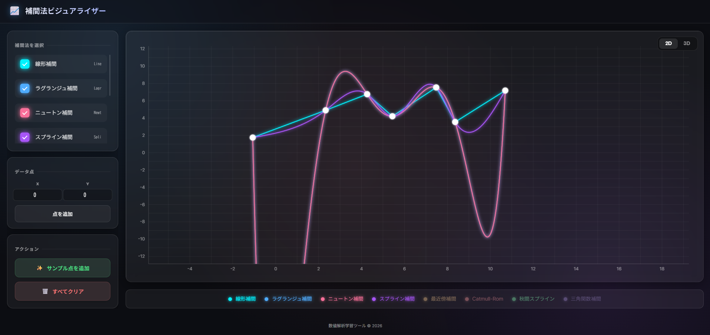

# 📈 Interpolation Visualizer (補間法ビジュアライザー)

This Readme is written by AI.

数値解析における様々な「補間法（Interpolation Methods）」を、直感的に学び、比較できるインタラクティブなWebアプリケーションです。
2Dグラフだけでなく、3D空間での補間曲線の挙動も可視化できます。



## 🚀 デモ
**[Live Demo](https://koto-thing.github.io/interpolation_visualizer/)**

## ✨ 主な機能

*   **多様な補間アルゴリズム**:
    *   **線形補間 (Linear)**: 最も基本的な点をつなぐ補間。
    *   **ラグランジュ補間 (Lagrange)**: 全ての点を通る多項式を生成。
    *   **ニュートン補間 (Newton)**: 差分商を用いた多項式補間。
    *   **スプライン補間 (Cubic Spline)**: 滑らかで自然な曲線を生成。
    *   **最近傍補間 (Nearest Neighbor)**: 階段状のグラフ。
    *   **Catmull-Rom (Hermite)**: 制御しやすく美しい曲線。
    *   **秋間スプライン (Akima)**: 振動（オーバーシュート）を抑えた安定した曲線。
    *   **三角関数補間 (Trigonometric)**: 周期的な波形として補間。

*   **インタラクティブな操作**:
    *   グラフをクリックして点を追加。
    *   点をドラッグして移動。
    *   右クリックで点を削除。
    *   座標の手動入力（X, Y, Z）。

*   **3Dモード搭載**:
    *   `Three.js` (React Three Fiber) を使用した3次元グラフ表示。
    *   マウス操作で回転・ズーム・移動が可能。

*   **モダンなUI**:
    *   グラスモーフィズム（すりガラス調）を採用した美しいデザイン。
    *   レスポンシブ対応。

## 🛠️ 技術スタック

*   **Frontend Framework**: [React](https://reactjs.org/)
*   **Language**: [TypeScript](https://www.typescriptlang.org/)
*   **Build Tool**: [Vite](https://vitejs.dev/)
*   **3D Graphics**: [Three.js](https://threejs.org/) / [React Three Fiber](https://docs.pmnd.rs/react-three-fiber)
*   **Deploy**: GitHub Pages

## 📦 インストールと実行

```bash
# リポジトリのクローン
git clone https://github.com/koto-thing/interpolation_visualizer.git

# ディレクトリ移動
cd interpolation_visualizer

# 依存関係のインストール
npm install

# 開発サーバーの起動
npm run dev
```

## 📝 使い方

1.  **補間法の選択**: 左上のパネルから、表示したいアルゴリズムにチェックを入れます。
2.  **点の追加**:
    *   **グラフクリック**: 2Dモードではクリックした位置に点が追加されます。
    *   **手動入力**: 左パネルのフォームに数値を入力し、「点を追加」を押します。
    *   **サンプル**: 「サンプル点を追加」ボタンでデモデータをロードできます。
3.  **操作**:
    *   **2Dモード**: ホイールで拡大縮小、右ドラッグで移動、左ドラッグで点を移動。
    *   **3Dモード**: 画面右上の「3D」ボタンで切り替え。マウスドラッグで視点操作。

## 📄 License

MIT License